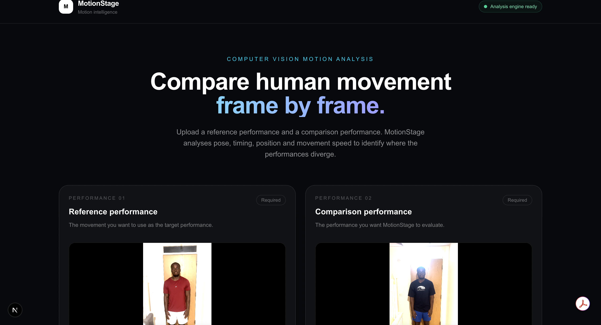
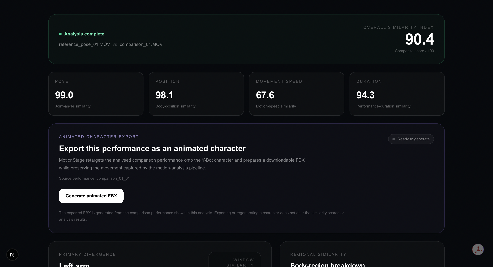
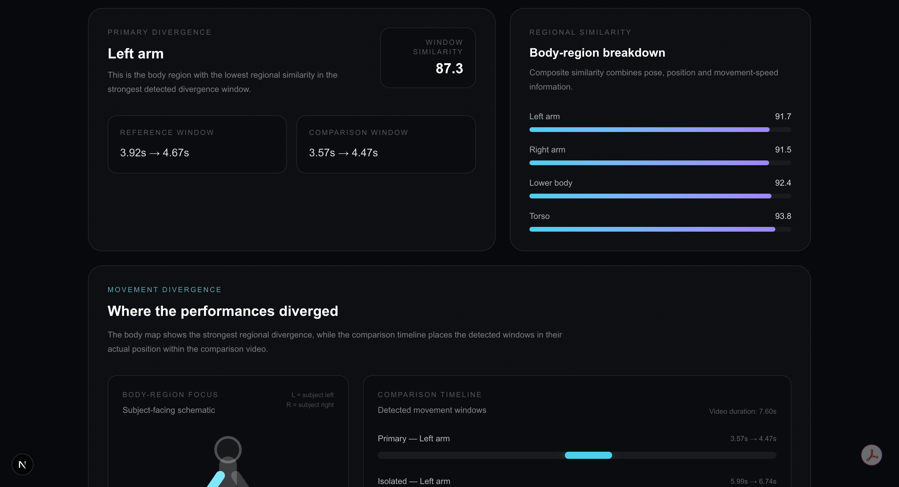
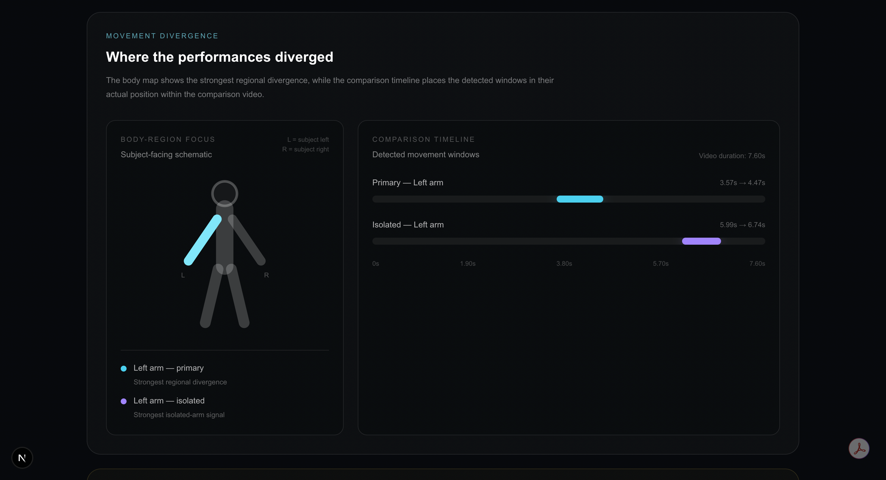
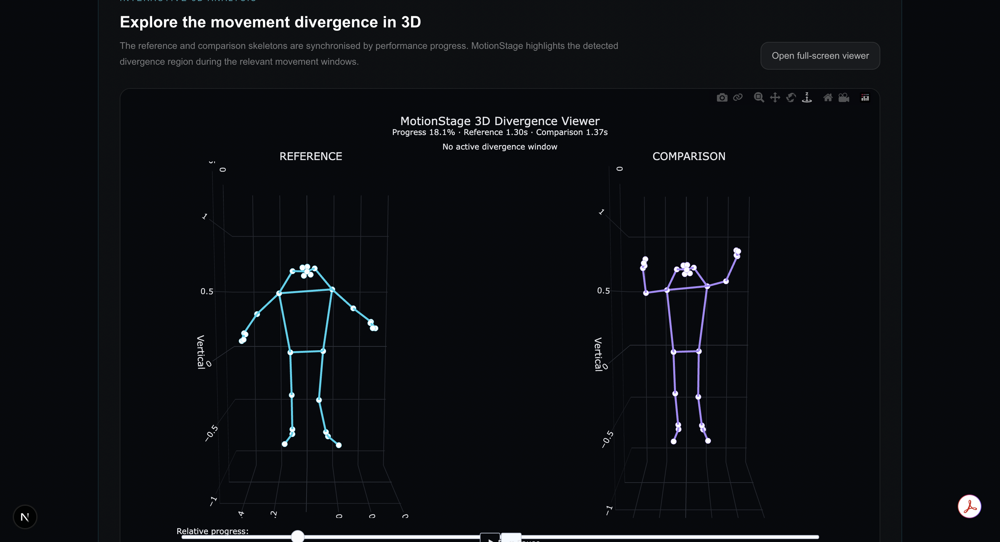
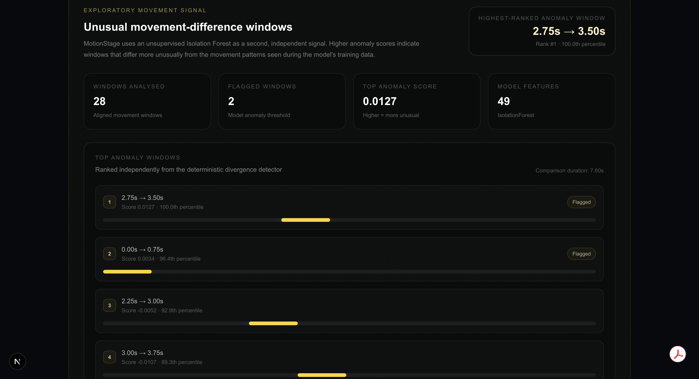

# MotionStage

MotionStage is an end-to-end full-body movement-analysis and character-animation system for comparing human performances from video.

It extracts human pose, aligns two performances, measures similarity, identifies where and when movement diverges, visualises the comparison in 3D, and can retarget the analysed motion onto an animated character for FBX export.

<p align="center">
  
</p>

## Demo

For a step-by-step end-to-end walkthrough, see the [MotionStage Demo Guide](docs/DEMO.md).

The demo uses your own short reference and comparison videos; sample performance videos are not distributed with this repository.

## What MotionStage Does

Given a **reference performance** and a **comparison performance**, MotionStage can:

- track and normalise full-body pose
- extract movement features
- align performances through time
- calculate overall and component similarity scores
- identify regional and temporal movement divergence
- perform exploratory Isolation Forest anomaly analysis
- visualise synchronised movement in 3D
- retarget analysed motion through Blender
- export animated FBX and Blender project files

## Analysis Outputs

MotionStage reports:

- **Overall similarity**
- **Pose similarity**
- **Body-position similarity**
- **Movement-speed similarity**
- **Performance-duration similarity**
- **Body-region similarity**
- **Temporal divergence windows**
- **Regional divergence**
- **Isolation Forest anomaly windows**

## Pipeline

```text
Reference + Comparison videos
            ↓
      Pose extraction
            ↓
 Quality validation
            ↓
Smoothing + normalisation
            ↓
 Feature extraction
            ↓
Performance alignment
            ↓
 Similarity scoring
            ↓
Regional + temporal analysis
            ↓
    3D visualisation
            ↓
  Blender retargeting
            ↓
   Animated FBX export

```

## Technology Stack

| Area | Technologies |
| --- | --- |
| Backend | Python, FastAPI |
| Pose | RTMLib, MediaPipe |
| Vision | OpenCV |
| Data | NumPy, pandas, SciPy |
| Machine learning | scikit-learn, Isolation Forest |
| Visualisation | Matplotlib, Plotly, 3D pose viewer |
| Frontend | Next.js, React, TypeScript |
| Animation | Blender, Python, FBX |

## Example Analysis

MotionStage combines several movement measures into a single analysis while preserving the individual components for inspection.



The example above reports an overall similarity score alongside pose, body-position, movement-speed and duration similarity.

## Movement Divergence

Rather than returning only a global score, MotionStage localises movement differences by **body region and time window**.



The body-region view identifies the strongest detected divergence while the timeline shows where the relevant windows occur within the comparison performance.

<details>
<summary><strong>View regional similarity breakdown</strong></summary>

<br>



</details>

## Interactive 3D Comparison

MotionStage also generates synchronised 3D pose representations of the reference and comparison performances.



The viewer follows both performances by relative progress and can highlight the detected divergence region during relevant movement windows.

## Exploratory Anomaly Analysis

An independent Isolation Forest pipeline provides an additional unsupervised signal for unusually different movement windows.



The anomaly signal is intentionally presented separately from the deterministic similarity and divergence analysis rather than being treated as a pass/fail judgement.


## Tested Environment

MotionStage has been tested with:

- Python 3.13.5
- Node.js v26.3.0
- npm 11.16.0
- Blender 4.1.1
- macOS

The project uses two Python environments:

1. the main MotionStage backend environment
2. a dedicated Pose3D / MediaPipe environment

Blender uses its own bundled Python runtime for `bpy` and `mathutils`.

## Project Structure

```text
MotionStage/
├── assets/
│   └── characters/
│       └── ybot.fbx                 # local asset, not tracked
├── backend/
│   └── motionstage/
│       ├── analysis/
│       ├── animation/
│       ├── api/
│       ├── comparison/
│       ├── features/
│       ├── ml/
│       ├── pose/
│       ├── pose3d/
│       ├── processing/
│       └── video/
├── data/
│   ├── animation/
│   ├── comparisons/
│   ├── processed/
│   └── raw/
├── frontend/
│   └── src/
├── models/
│   └── pose_landmarker_full.task    # local model, not tracked
├── compare_performances.py
├── process_performance.py
├── requirements.txt
└── requirements-pose3d.txt
```

Most contents of `data/`, generated animation outputs, frontend build files, virtual environments and runtime caches are ignored by Git.

## Main Python Environment

Create the main environment from the project root:

```bash
python -m venv .venv
source .venv/bin/activate

python -m pip install --upgrade pip
python -m pip install -r requirements.txt
```

The main environment contains the FastAPI backend, RTMLib pose pipeline, OpenCV, comparison engine, scientific Python stack and visualisation dependencies.

## Pose3D Environment

MotionStage uses a separate environment for MediaPipe Pose3D processing and the anomaly-analysis worker.

Create it from the project root:

```bash
python -m venv .venv_pose3d
source .venv_pose3d/bin/activate

python -m pip install --upgrade pip
python -m pip install -r requirements-pose3d.txt

deactivate
```

The backend expects the interpreter at:

```text
.venv_pose3d/bin/python
```

## MediaPipe Pose Model

The Pose3D pipeline expects a MediaPipe pose-landmarker model at:

```text
models/pose_landmarker_full.task
```

The `models/` directory is excluded from normal Git tracking, so the model file must be supplied locally before Pose3D processing is used.

## Y-Bot Character Asset

The animated-character pipeline expects a local Y-Bot FBX asset at:

```text
assets/characters/ybot.fbx
```

The Y-Bot FBX is **not distributed with this repository**. Download the Y-Bot character from Adobe Mixamo using your own Adobe account and place the downloaded FBX at the path above.

MotionStage uses this source model when retargeting analysed performance motion onto the animated character.

## Blender

Install Blender as a normal macOS application.

The tested configuration is:

```text
Blender 4.1.1
/Applications/Blender.app
```

MotionStage launches Blender headlessly when generating an animated character.

The Blender-specific scripts use Blender's bundled `bpy` and `mathutils`; these packages should not be installed into the normal MotionStage Python environments.

## Start the Backend

From the MotionStage project root, activate the main Python environment:

```bash
source .venv/bin/activate
```

Then start FastAPI:

```bash
PYTHONPATH="$PWD:$PWD/backend/motionstage/api" \
python -m uvicorn backend.motionstage.api.main:app --reload --port 8000
```

The backend will run at:

```text
http://127.0.0.1:8000
```

Keep this terminal open.

## Start the Frontend

Open another terminal:

```bash
cd ~/Desktop/MotionStage/frontend
npm install
npm run dev
```

Open:

```text
http://localhost:3000
```

## Using MotionStage

### 1. Upload performances

Upload a reference performance and a comparison performance.

Supported frontend formats include MOV, MP4 and M4V.

The reference represents the target movement. The comparison represents the performance MotionStage evaluates.

### 2. Analyse performances

Select **Analyse performances**.

MotionStage processes both videos and produces the comparison result.

### 3. Review similarity scores

The interface reports:

- Overall Similarity Index
- Pose
- Position
- Movement Speed
- Duration

These scores describe different components of the comparison rather than a single pose-only metric.

### 4. Inspect movement divergence

MotionStage identifies:

- the strongest regional divergence
- the relevant movement window
- isolated arm divergence signals
- body-region similarity scores

The body schematic and comparison timeline indicate where and when the performances differ.

### 5. Review anomaly analysis

An Isolation Forest provides an additional exploratory signal.

It ranks movement windows by how unusual their motion-difference features are relative to the model's training data.

This signal is separate from the deterministic divergence detector.

### 6. Explore the 3D comparison

The 3D divergence viewer displays synchronised reference and comparison skeletons.

Playback is synchronised by relative performance progress so performances of different durations can still be inspected together.

Detected divergence regions are highlighted during the relevant windows.

### 7. Generate an animated character

Select **Generate animated FBX**.

MotionStage then:

1. exports an animation package
2. launches Blender headlessly
3. imports the Y-Bot character
4. retargets the comparison-performance motion
5. validates the retarget
6. saves a Blender project
7. exports an animated FBX

When successful, the interface displays **FBX ready**.

The generated FBX and Blender project can then be downloaded from the frontend.

## Character Retargeting

The current character pipeline uses an in-place, pelvis-relative motion policy.

The exported character therefore preserves the captured body movement while avoiding unwanted global translation.

The frontend also reports a sampled retarget-validation error after generation.

## Pose Quality Validation

MotionStage validates whether a sufficiently reliable human pose was detected before continuing with the analysis.

Videos where the person is missing, obscured or detected with very low joint confidence are rejected with a user-facing error instead of producing misleading similarity results.

For best results:

- keep the full body visible
- use a stable camera
- avoid severe occlusion
- ensure reasonable lighting
- keep the performer large enough in frame

## Duplicate Filenames

MotionStage creates collision-safe internal performance identifiers so previous analyses do not prevent new uploads from being processed.

The reference and comparison videos in a single analysis must represent separate uploaded performances.

## Generated Data

Runtime outputs are written beneath `data/`.

Examples include:

```text
data/processed/
data/comparisons/
data/animation/
data/blender/
data/ml/
data/unreal/
```

These directories contain generated data and are excluded from normal repository tracking.

Generated FBX output may also be written beneath:

```text
output/
```

## Command-Line Processing

A single performance can be processed directly using:

```bash
python process_performance.py <video>
```

Processed pose and feature data are written to:

```text
data/processed/<performance-name>/
```

Two processed performances can be compared through the command-line comparison entry point:

```bash
python compare_performances.py <reference> <comparison>
```

Here, `<reference>` and `<comparison>` are processed performance names such as `test_performance_01`.

## Backend Architecture

The principal backend modules are organised by responsibility.

- `backend/motionstage/pose/` — 2D human-pose tracking
- `backend/motionstage/processing/` — pose smoothing and normalisation
- `backend/motionstage/features/` — frame-level movement-feature extraction
- `backend/motionstage/comparison/` — performance alignment, similarity scoring and divergence localisation
- `backend/motionstage/ml/` — window datasets and Isolation Forest anomaly analysis
- `backend/motionstage/pose3d/` — MediaPipe-based 3D pose extraction and comparison visualisation
- `backend/motionstage/animation/` — animation packaging, Blender execution, Y-Bot retargeting and FBX generation
- `backend/motionstage/api/` — FastAPI endpoints connecting processing, analysis, visualisation and character export

## Frontend

The user interface is implemented with Next.js and TypeScript.

The primary page is:

```text
frontend/src/app/page.tsx
```

The frontend API client is:

```text
frontend/src/lib/motionstage-api.ts
```

## Development Validation

The cleaned repository has been validated with:

```bash
python -m py_compile \
  process_performance.py \
  compare_performances.py \
  backend/motionstage/api/main.py
```

The frontend has also passed:

```bash
cd frontend
npm run build
```

A clean Python environment recreated from `requirements.txt` successfully passed the MotionStage dependency import smoke test.

The dedicated Pose3D environment also reports no broken package requirements.

## Current Status

MotionStage currently supports an end-to-end workflow:

```text
Video upload
    ↓
2D pose extraction
    ↓
Pose smoothing + normalisation
    ↓
Motion-feature extraction
    ↓
Performance alignment
    ↓
Similarity scoring
    ↓
Regional divergence detection
    ↓
Exploratory anomaly analysis
    ↓
3D comparison viewer
    ↓
Y-Bot motion retargeting
    ↓
Animated FBX export
```

The current project is a functional prototype intended for movement-analysis, computer-vision and character-animation experimentation.
